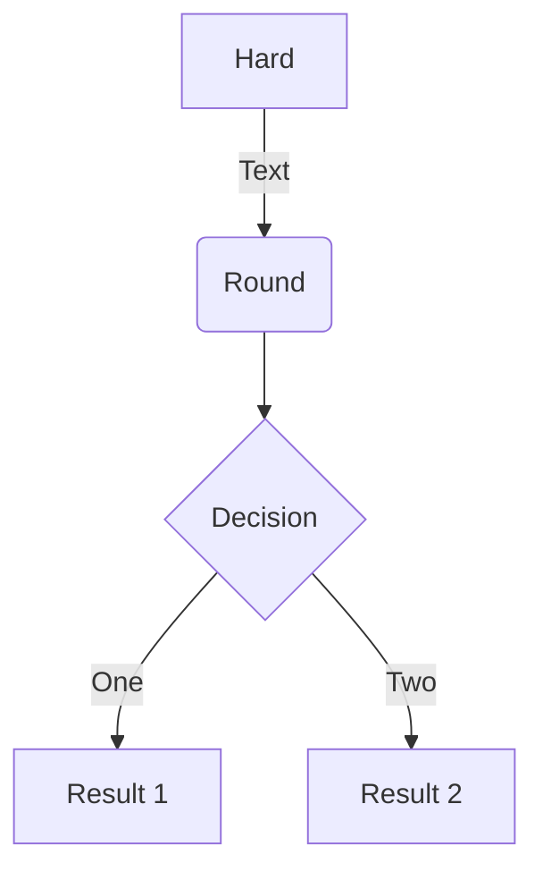

一级标题
===================

二级标题
-------------------


```c++
// Comment and "var" highlighting is only for JavaScript
int i = 5;
```

| **尝试一个表格** |    anto | midle |
| ---------------- | ------: | :---: |
| 表头             | another | test  |
| val              |     val |   a   |


```javascript {.class1 .class}
function add(x, y) {
  return x + y
}
```

[marknew](https://shd101wyy.github.io/markdown-preview-enhanced/#/zh-cn/usages?id=%e5%91%bd%e4%bb%a4)

```js
$(document).ready(function () {
    alert('RUNOOB');
});
```

* first
  * another

---
## 分割？

---
是的
@import "1.jpg"
$$
\mathbf{V}_1 \times \mathbf{V}_2 =  \begin{vmatrix} 
\mathbf{i} & \mathbf{j} & \mathbf{k} \\
\frac{\partial X}{\partial u} &  \frac{\partial Y}{\partial u} & 0 \\
\frac{\partial X}{\partial v} &  \frac{\partial Y}{\partial v} & 0 \\
\end{vmatrix}
${$tep1}{\style{visibility:hidden}{(x+1)(x+1)}}
$$



