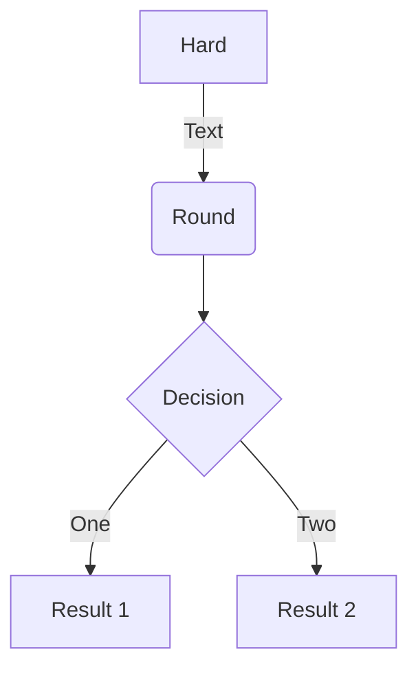

  
一级标题
===================
  
二级标题
-------------------
  

  
```c++
// Comment and "var" highlighting is only for JavaScript
int i = 5;
```
  
| **尝试一个表格** |    anto | midle |
| ---------------- | ------: | :---: |
| 表头             | another | test  |
| val              |     val |   a   |
  
  
```javascript
function add(x, y) {
  return x + y
}
```
  
[marknew](https://shd101wyy.github.io/markdown-preview-enhanced/#/zh-cn/usages?id=%e5%91%bd%e4%bb%a4 )
  
```js
$(document).ready(function () {
    alert('RUNOOB');
});
```
  
* first
  * another
  
---
##  分割？
  
  
---
是的
  
<p align="center">tep1}{&#x5C;style{visibility:hidden}{(x+1)(x+1)}}"/></p>  
  
  
  

  
